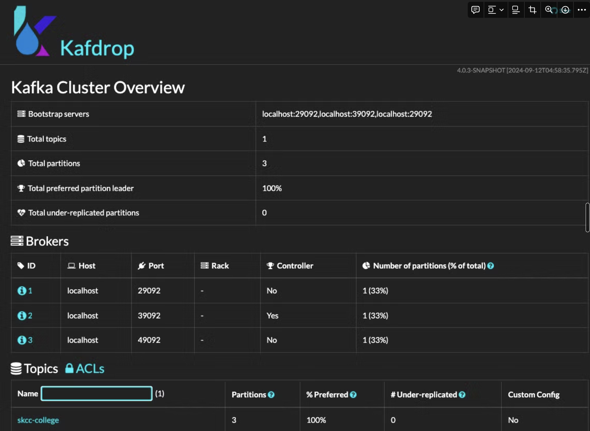
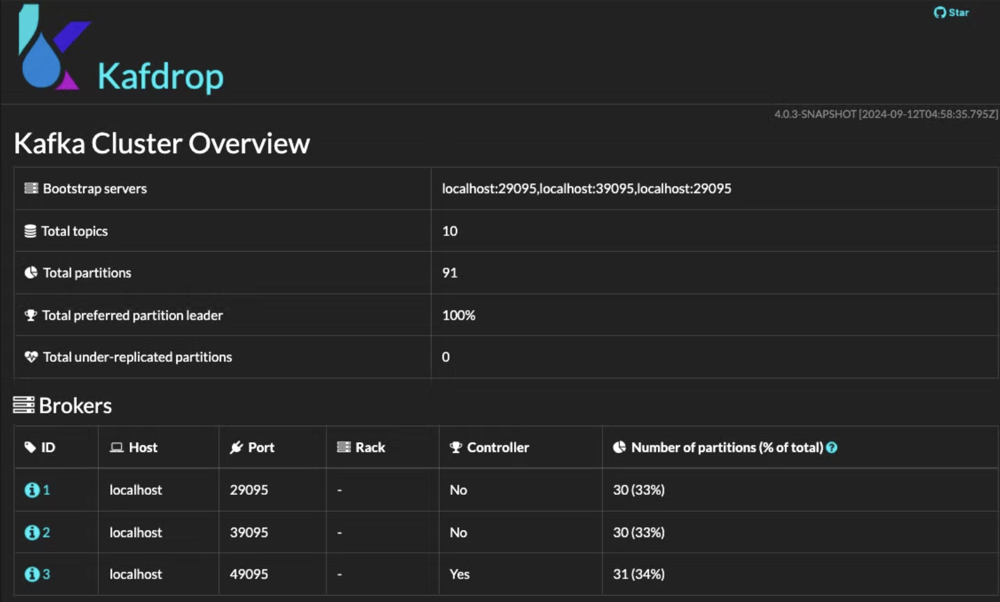

# MirrorMaker 2

### 실습 구성도


### Cluster-Source

|  | **kafka-server1** | **kafka-server2** | **kafka-server3** |
| --- | --- | --- | --- |
| node.id | 1 | 2 | 3 |
| listeners | PLAINTEXT://:29092,CONTROLLER://:29093 | PLAINTEXT://:39092,CONTROLLER://:39093 | PLAINTEXT://:49092,CONTROLLER://:49093 |
| advertised.listeners | PLAINTEXT://localhost:29092 | PLAINTEXT://localhost:39092 | PLAINTEXT://localhost:49092 |
| controller.quorum.voters | 1@localhost:29093,2@localhost:39093,3@localhost:49093 | 1@localhost:29093,2@localhost:39093,3@localhost:49093 | 1@localhost:29093,2@localhost:39093,3@localhost:49093 |
| log.dirs | source-data/kafka-server1 | source-data/kafka-server2 | source-data/kafka-server3 |


### Cluster-Target

|  | **kafka-server1** | **kafka-server2** | **kafka-server3** |
| --- | --- | --- | --- |
| node.id | 1 | 2 | 3 |
| listeners | PLAINTEXT://:29095,CONTROLLER://:29096 | PLAINTEXT://:39095,CONTROLLER://:39096 | PLAINTEXT://:49095,CONTROLLER://:49096 |
| advertised.listeners | PLAINTEXT://localhost:29095 | PLAINTEXT://localhost:39095 | PLAINTEXT://localhost:49095 |
| controller.quorum.voters | 1@localhost:29096,2@localhost:39096,3@localhost:49096 | 1@localhost:29096,2@localhost:39096,3@localhost:49096 | 1@localhost:29096,2@localhost:39096,3@localhost:49096 |
| log.dirs | target-data/kafka-server1 | target-data/kafka-server2 | target-data/kafka-server3 |


### **Kafka Cluster with KRaft**

```bash
# 공통 설정
git clone https://github.com/n06919/mirrormaker2.git

tar -xzf /config/workspace/kafka_2.13-3.8.0.tgz -C /config/workspace/mirrormaker2

export MM2_HOME=/config/workspace/mirrormaker2
cd $MM2_HOME

mkdir -p ./kafka_2.13-3.8.0/source-data/kafka-server1
mkdir -p ./kafka_2.13-3.8.0/source-data/kafka-server2
mkdir -p ./kafka_2.13-3.8.0/source-data/kafka-server3
mkdir -p ./kafka_2.13-3.8.0/target-data/kafka-server1
mkdir -p ./kafka_2.13-3.8.0/target-data/kafka-server2
mkdir -p ./kafka_2.13-3.8.0/target-data/kafka-server3

```

### Cluster-Source

- kafka-server1:
    
    ```bash
    # 터미널 새창-1
    export MM2_HOME=/config/workspace/mirrormaker2
    cd $MM2_HOME/kafka_2.13-3.8.0
    KAFKA_CLUSTER_ID=KAFKA_CLUSTER_MM2_A
    
    # Format Log Directories
    $ ./bin/kafka-storage.sh format -t ${KAFKA_CLUSTER_ID} -c ../config/source-config/kafka-server1/config/server.properties
    
    # Start the Kafka Server
    $ export LOG_DIR=$MM2_HOME/kafka_2.13-3.8.0/logs/source-data/kafka-server1
    $ ./bin/kafka-server-start.sh ../config/source-config/kafka-server1/config/server.properties
    
    ```
    
- kafka-server2:
    
    ```bash
    # 터미널 새창-2
    export MM2_HOME=/config/workspace/mirrormaker2
    cd $MM2_HOME/kafka_2.13-3.8.0
    KAFKA_CLUSTER_ID=KAFKA_CLUSTER_MM2_A
    
    # Format Log Directories
    $ ./bin/kafka-storage.sh format -t ${KAFKA_CLUSTER_ID} -c ../config/source-config/kafka-server2/config/server.properties
    
    # Start the Kafka Server
    $ export LOG_DIR=$MM2_HOME/kafka_2.13-3.8.0/logs/source-data/kafka-server2
    $ ./bin/kafka-server-start.sh ../config/source-config/kafka-server2/config/server.properties
    
    ```
    
- kafka-server3:
    
    ```bash
    # 터미널 새창-3
    export MM2_HOME=/config/workspace/mirrormaker2
    cd $MM2_HOME/kafka_2.13-3.8.0
    KAFKA_CLUSTER_ID=KAFKA_CLUSTER_MM2_A
    
    # Format Log Directories
    $ ./bin/kafka-storage.sh format -t ${KAFKA_CLUSTER_ID} -c ../config/source-config/kafka-server3/config/server.properties
    
    # Start the Kafka Server
    $ export LOG_DIR=$MM2_HOME/kafka_2.13-3.8.0/logs/source-data/kafka-server3
    $ ./bin/kafka-server-start.sh ../config/source-config/kafka-server3/config/server.properties
    ```
    
- 설치확인
    
    ```bash
    
    터미널 새창-4
    # 프로세스 확인
    netstat -ntlp
    (Not all processes could be identified, non-owned process info
     will not be shown, you would have to be root to see it all.)
    Active Internet connections (only servers)
    Proto Recv-Q Send-Q Local Address           Foreign Address         State       PID/Program name    
    ......  
    tcp6       0      0 :::39092                :::*                    LISTEN      11325/java          
    tcp6       0      0 :::39093                :::*                    LISTEN      11325/java                
    tcp6       0      0 :::29092                :::*                    LISTEN      10835/java          
    tcp6       0      0 :::49092                :::*                    LISTEN      10376/java          
    tcp6       0      0 :::29093                :::*                    LISTEN      10835/java          
    tcp6       0      0 :::49093                :::*                    LISTEN      10376/java          
    tcp6       0      0 :::39335                :::*                    LISTEN      10835/java   
    
    export MM2_HOME=/config/workspace/mirrormaker2
    
    cd $MM2_HOME/kafka_2.13-3.8.0
    ./bin/kafka-metadata-quorum.sh --bootstrap-server localhost:29092,localhost:39092,localhost:49092 describe --status
    <결과>
    ClusterId:              KAFKA_CLUSTER_MM2_A
    LeaderId:               3
    LeaderEpoch:            3
    HighWatermark:          277
    MaxFollowerLag:         1
    MaxFollowerLagTimeMs:   498
    CurrentVoters:          [1,2,3]
    CurrentObservers:       []
    
    ./bin/kafka-metadata-quorum.sh --bootstrap-server localhost:29092,localhost:39092,localhost:49092 describe --replication
    <결과>
    NodeId  LogEndOffset    Lag     LastFetchTimestamp      LastCaughtUpTimestamp   Status  
    3       318             0       1727139256030           1727139256030           Leader  
    1       318             0       1727139255964           1727139255964           Follower
    2       318             0       1727139255961           1727139255961           Follower
    
    ./bin/kafka-topics.sh --create --bootstrap-server localhost:29092 --replication-factor 3 --partitions 3 --topic skcc-college
    
    ./bin/kafka-topics.sh --bootstrap-server localhost:29092 --describe --topic skcc-college
    <결과>
    Topic: skcc-college     TopicId: akcUiqqBRcGnv0Bp5llKLA PartitionCount: 3       ReplicationFactor: 3    Configs: segment.bytes=1073741824
            Topic: skcc-college     Partition: 0    Leader: 3       Replicas: 3,1,2 Isr: 3,1,2      Elr:    LastKnownElr: 
            Topic: skcc-college     Partition: 1    Leader: 1       Replicas: 1,2,3 Isr: 1,2,3      Elr:    LastKnownElr: 
            Topic: skcc-college     Partition: 2    Leader: 2       Replicas: 2,3,1 Isr: 2,3,1      Elr:    LastKnownElr: 
    ```
    

### **Kafka Web UI -** KAFKA_CLUSTER_MM2_A

```bash
# 터미널 새창
# git clone https://github.com/obsidiandynamics/kafdrop.git
cd kafdrop
# ./mvnw clean package -DskipTests

java --add-opens=java.base/sun.nio.ch=ALL-UNNAMED \
    -jar target/kafdrop-4.0.3-SNAPSHOT.jar \
    --server.port=9000
    --kafka.brokerConnect=localhost:29092,localhost:39092,localhost:29092
    
http://localhost:9000
```


### Cluster-Target

- kafka-server1:
    
    ```bash
    # 터미널 새창-1
    export MM2_HOME=/config/workspace/mirrormaker2
    cd $MM2_HOME/kafka_2.13-3.8.0
    KAFKA_CLUSTER_ID=KAFKA_CLUSTER_MM2_B
    
    # Format Log Directories
    $ ./bin/kafka-storage.sh format -t ${KAFKA_CLUSTER_ID} -c ../config/target-config/kafka-server1/config/server.properties
    
    # Start the Kafka Server
    $ export LOG_DIR=$MM2_HOME/kafka_2.13-3.8.0/logs/target-data/kafka-server1
    $ ./bin/kafka-server-start.sh ../config/target-config/kafka-server1/config/server.properties
    
    ```
    
- kafka-server2:
    
    ```bash
    # 터미널 새창-3
    export MM2_HOME=/config/workspace/mirrormaker2
    cd $MM2_HOME/kafka_2.13-3.8.0
    KAFKA_CLUSTER_ID=KAFKA_CLUSTER_MM2_B
    
    # Format Log Directories
    $ ./bin/kafka-storage.sh format -t ${KAFKA_CLUSTER_ID} -c ../config/target-config/kafka-server2/config/server.properties
    
    # Start the Kafka Server
    $ export LOG_DIR=$MM2_HOME/kafka_2.13-3.8.0/logs/target-data/kafka-server2
    $ ./bin/kafka-server-start.sh ../config/target-config/kafka-server2/config/server.properties
    
    ```
    
- kafka-server3:
    
    ```bash
    # 터미널 새창-3
    export MM2_HOME=/config/workspace/mirrormaker2
    cd $MM2_HOME/kafka_2.13-3.8.0
    KAFKA_CLUSTER_ID=KAFKA_CLUSTER_MM2_B
    
    # Format Log Directories
    $ ./bin/kafka-storage.sh format -t ${KAFKA_CLUSTER_ID} -c ../config/target-config/kafka-server3/config/server.properties
    
    # Start the Kafka Server
    $ export LOG_DIR=$MM2_HOME/kafka_2.13-3.8.0/logs/target-data/kafka-server3
    $ ./bin/kafka-server-start.sh ../config/target-config/kafka-server3/config/server.properties
    ```
    
- 설치확인
    
    ```bash
    
    # 프로세스 확인
    netstat -nltp
    (Not all processes could be identified, non-owned process info
     will not be shown, you would have to be root to see it all.)
    Active Internet connections (only servers)
    Proto Recv-Q Send-Q Local Address           Foreign Address         State       PID/Program name    
    ...
    tcp6       0      0 :::39092                :::*                    LISTEN      11325/java            
    tcp6       0      0 :::39093                :::*                    LISTEN      11325/java          
    tcp6       0      0 :::39095                :::*                    LISTEN      31522/java              
    tcp6       0      0 :::39096                :::*                    LISTEN      31522/java              
    tcp6       0      0 :::29092                :::*                    LISTEN      10835/java          
    tcp6       0      0 :::49092                :::*                    LISTEN      10376/java          
    tcp6       0      0 :::29093                :::*                    LISTEN      10835/java          
    tcp6       0      0 :::49093                :::*                    LISTEN      10376/java          
    tcp6       0      0 :::29095                :::*                    LISTEN      31970/java          
    tcp6       0      0 :::49095                :::*                    LISTEN      31017/java                
    tcp6       0      0 :::29096                :::*                    LISTEN      31970/java          
    tcp6       0      0 :::49096                :::*                    LISTEN      31017/java          
    tcp6       0      0 :::9000                 :::*                    LISTEN      15198/java          
    
    ./bin/kafka-metadata-quorum.sh --bootstrap-server localhost:29095,localhost:39095,localhost:49095 describe --status
    <결과>
    ClusterId:              f8pMXeKlQ7GcaTkk9DEhJQ
    LeaderId:               1
    LeaderEpoch:            12
    HighWatermark:          302
    MaxFollowerLag:         0
    MaxFollowerLagTimeMs:   0
    CurrentVoters:          [1,2,3]
    CurrentObservers:       []
    
    ./bin/kafka-metadata-quorum.sh --bootstrap-server localhost:29095,localhost:39095,localhost:49095 describe --replication
    <결과>
    NodeId  LogEndOffset    Lag     LastFetchTimestamp      LastCaughtUpTimestamp   Status
    1       330             0       1726135482998           1726135482998           Leader
    2       330             0       1726135482746           1726135482746           Follower
    3       330             0       1726135482744           1726135482744           Follower
    
    ```
    

### **Kafka Web UI -** KAFKA_CLUSTER_MM2_B

```bash
# 터미널 새창
# git clone https://github.com/obsidiandynamics/kafdrop.git
cd kafdrop
# ./mvnw clean package -DskipTests

java --add-opens=java.base/sun.nio.ch=ALL-UNNAMED \
    -jar target/kafdrop-4.0.3-SNAPSHOT.jar \
    --server.port=9001 \
    --management.server.port=9001 \
    --kafka.brokerConnect=localhost:29095,localhost:39095,localhost:29095
    
http://localhost:9001
```



### MM2 환경설정

- mmw.properties
    
    ```bash
    # @@ 클러스터 설정 @@
    # 복제할 Kafka 클러스터 목록
    clusters=KAFKA_CLUSTER_MM2_A, KAFKA_CLUSTER_MM2_B
    
    # 클러스터의 부트스트랩 서버 주소
    KAFKA_CLUSTER_MM2_A.bootstrap.servers=localhost:29092,localhost:39092,localhost:49092
    KAFKA_CLUSTER_MM2_B.bootstrap.servers=localhost:29095,localhost:39095,localhost:49095
    
    #KAFKA_CLUSTER_MM2_A and KAFKA_CLUSTER_MM2_B configurations. Default value for the following settings is 3.
    #If you want more details about those internal configurations, please see https://docs.confluent.io/home/connect/userguide.html#kconnect-internal-topics
    #and https://docs.confluent.io/platform/current/connect/references/allconfigs.html#distributed-worker-configuration
    
    # @@ 복제 설정 @@
    
    # 구성 저장소 토픽의 복제 계수를 정의
    # 복제 계수는 해당 데이터를 얼마나 많은 브로커에 복제할지를 결정
    KAFKA_CLUSTER_MM2_A.config.storage.replication.factor=3
    KAFKA_CLUSTER_MM2_B.config.storage.replication.factor=3
    
    # 오프셋 저장소의 복제 계수를 설정
    # 소비자의 오프셋을 저장하는 토픽의 복제 계수로, 데이터 손실을 방지하기 위해 몇 개의 브로커에 복제할지를 결정
    KAFKA_CLUSTER_MM2_A.offset.storage.replication.factor=3
    KAFKA_CLUSTER_MM2_B.offset.storage.replication.factor=3
    
    # 상태 저장소 토픽의 복제 계수를 정의합니다. 커넥터의 상태 정보를 저장하는 데 사용
    KAFKA_CLUSTER_MM2_A.status.storage.replication.factor=3
    KAFKA_CLUSTER_MM2_B.status.storage.replication.factor=3
    
    # @@ 클러스터 간 복제 활성화 @@
    # 이 설정은 데이터가 양방향으로 동기화
    KAFKA_CLUSTER_MM2_A->KAFKA_CLUSTER_MM2_B.enabled=true
    KAFKA_CLUSTER_MM2_B->KAFKA_CLUSTER_MM2_A.enabled=true
    
    # Default value for the following settings is 3
    # @@ 미러링 토픽 설정 @@
    # 오프셋 동기화 토픽의 복제 계수를 설정합니다. 클러스터 간 소비자 오프셋을 동기화하는 데 사용
    offset-syncs.topic.replication.factor=3
    
    # 하트비트 토픽의 복제 계수를 설정합니다. 클러스터 간의 통신 상태를 확인하는 하트비트를 보관하는 토픽
    heartbeats.topic.replication.factor=3
    
    # 체크포인트 토픽의 복제 계수를 정의합니다. 체크포인트는 각 클러스터에서 어디까지 복제되었는지를 추적하는 데 사용
    checkpoints.topic.replication.factor=3
    
    # @@ 복제 대상 토픽 및 그룹 @@
    # 복제할 토픽을 정의합니다. .*는 모든 토픽을 복제
    topics=.*
    
    # 복제할 소비자 그룹을 정의합니다. .*는 모든 그룹을 포함
    groups=.*
    
    # MirrorMaker가 동시에 실행할 수 있는 작업의 최대 개수를 지정합니다. 
    # 여기서는 2개의 작업이 병렬로 실행
    tasks.max=2
    
    # 복제된 메시지를 몇 개의 브로커에 저장할지를 결정
    replication.factor=3
    
    # 새로운 토픽이 추가될 때 자동으로 토픽 목록을 새로 고침할지를 설정
    refresh.topics.enabled=true
    
    # 복제 중 토픽 설정을 동기화할지를 설정
    sync.topic.configs.enabled=true
    
    # 토픽 목록을 새로 고침하는 간격을 초 단위로 설정
    refresh.topics.interval.seconds=30
    
    # @@ 블랙리스트 설정 @@
    # 복제하지 않을 토픽을 지정합니다. 내부 토픽이나 복제본 관련 토픽은 제외
    topics.blacklist=.*[\-\.]internal, .*\.replica, __consumer_offsets
    
    # 복제하지 않을 소비자 그룹을 지정
    groups.blacklist=console-consumer-.*, connect-.*, __.*
    
    # @@ 하트비트 및 체크포인트 활성화 @@
    
    # 하트비트 전송을 활성화합니다. 클러스터 간 연결 상태를 확인하기 위해 사용
    KAFKA_CLUSTER_MM2_A->KAFKA_CLUSTER_MM2_B.emit.heartbeats.enabled=true
    KAFKA_CLUSTER_MM2_B->KAFKA_CLUSTER_MM2_A.emit.heartbeats.enabled=true
    
    # 체크포인트 전송을 활성화합니다. 복제된 데이터의 상태를 추적
    KAFKA_CLUSTER_MM2_A->KAFKA_CLUSTER_MM2_B.emit.checkpoints.enabled=true
    KAFKA_CLUSTER_MM2_B->KAFKA_CLUSTER_MM2_A.emit.checkpoints.enabled=true
    ```
    

MM2 실행

```bash

export MM2_HOME=/config/workspace/mirrormaker2
cd $MM2_HOME/kafka_2.13-3.8.0

./bin/connect-mirror-maker.sh  ../config/mm2-config/mm2.properties
```

### Producer

```bash
export MM2_HOME=/config/workspace/mirrormaker2
cd $MM2_HOME/kafka_2.13-3.8.0
./bin/kafka-console-producer.sh --topic mm2-test --bootstrap-server localhost:29092
```

### Consumer

```bash
export MM2_HOME=/config/workspace/mirrormaker2
cd $MM2_HOME/kafka_2.13-3.8.0

topic: KAFKA_CLUSTER_MM2_A.mm2-test
./bin/kafka-console-consumer.sh --topic KAFKA_CLUSTER_MM2_A.mm2-test --from-beginning --bootstrap-server localhost:29095
```